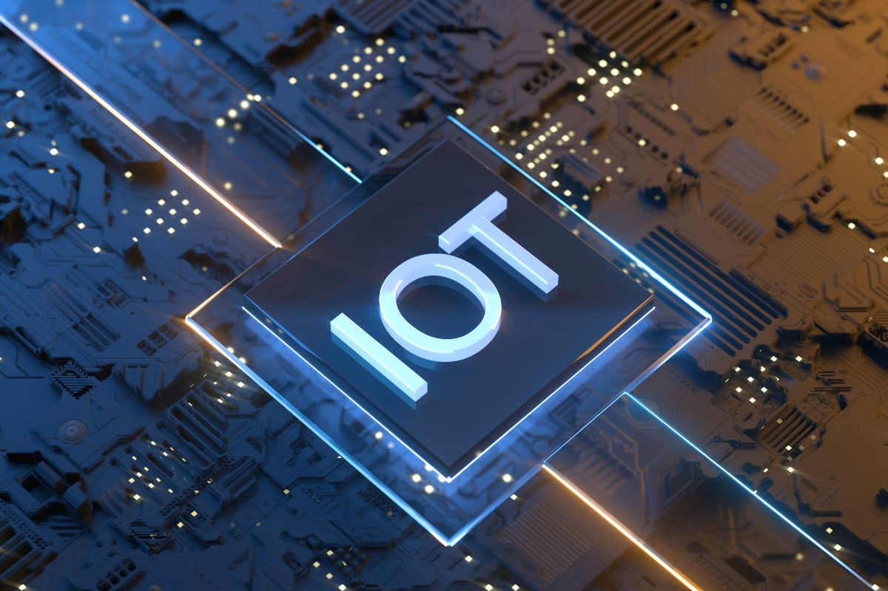
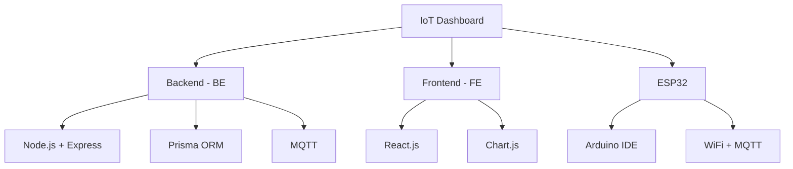

<div align="center">

# 🌐 IoT Dashboard



*A comprehensive solution for monitoring and controlling IoT devices through an intuitive web interface*

[](https://choosealicense.com/licenses/mit/)
[](https://nodejs.org/)
[](https://reactjs.org/)
[](https://expressjs.com/)
[](https://www.mysql.com/)

</div>

## 👨‍💻 Tác giả

**Lê Huy Hồng Nhật**  
Sinh viên tại Học viện Công nghệ Bưu chính Viễn thông (PTIT)

## 📑 Mục lục

- [🌟 Tính năng](#-tính-năng)
- [🏗️ Cấu trúc dự án](#️-cấu-trúc-dự-án)
- [🛠️ Công nghệ sử dụng](#️-công-nghệ-sử-dụng)
- [⚙️ Cài đặt](#️-cài-đặt)
- [📱 Sử dụng](#-sử-dụng)
- [📚 API Documentation](#-api-documentation)
- [🤝 Đóng góp](#-đóng-góp)
- [📄 Giấy phép](#-giấy-phép)
- [📧 Liên hệ](#-liên-hệ)

## 🌟 Tính năng

| Tính năng | Mô tả |
|-----------|--------|
| 📊 **Realtime Data** | Cập nhật liên tục các chỉ số nhiệt độ, độ ẩm, ánh sáng |
| 🎮 **Remote Control** | Điều khiển thiết bị từ xa qua dashboard |
| 📱 **Responsive UI** | Giao diện tương thích mọi thiết bị |
| 🔐 **Authentication** | Hệ thống đăng nhập và phân quyền an toàn |
| 📈 **Data Analysis** | Phân tích và xem lại dữ liệu lịch sử |
| ⚡ **Alerts** | Thông báo khi chỉ số vượt ngưỡng |

## 🏗️ Cấu trúc dự án



### 🔧 Backend (BE)
- Xử lý dữ liệu và cung cấp API RESTful
- Quản lý kết nối với cơ sở dữ liệu
- Xử lý logic nghiệp vụ và xác thực
- Kết nối với thiết bị IoT thông qua MQTT

### 🎨 Frontend (FE)
- Giao diện người dùng web sử dụng React
- Hiển thị dữ liệu dưới dạng biểu đồ và bảng
- Cung cấp các điều khiển để tương tác với thiết bị IoT

### 🔌 ESP32
- Mã nguồn cho thiết bị IoT
- Đọc dữ liệu từ cảm biến và gửi lên server
- Nhận lệnh điều khiển từ server và thực thi

## 🛠️ Công nghệ sử dụng

<div align="center">

### Backend Stack
[](https://nodejs.org/)
[](https://expressjs.com/)
[](https://www.prisma.io/)
[](https://www.mysql.com/)
[](https://socket.io/)

### Frontend Stack
[](https://reactjs.org/)
[](https://www.chartjs.org/)
[](https://getbootstrap.com/)
[](https://axios-http.com/)

### IoT Stack
[](https://www.arduino.cc/)
[](https://www.espressif.com/)
[](https://mqtt.org/)

</div>

## ⚙️ Cài đặt

### Prerequisites

```bash
Node.js (v14.0.0+)
npm (v6.0.0+)
MySQL (v8.0+)
Arduino IDE (v1.8.0+)
```

### Backend Setup

```bash
# Di chuyển vào thư mục BE
cd BE

# Cài đặt dependencies
npm install

# Tạo file .env
cp .env.example .env

# Chạy migrations
npx prisma migrate dev

# Khởi động server
npm start
```

### Frontend Setup

```bash
# Di chuyển vào thư mục FE
cd FE

# Cài đặt dependencies
npm install

# Tạo file .env.local
cp .env.example .env.local

# Khởi động ứng dụng
npm start
```

### ESP32 Setup

```cpp
// Cấu hình trong Arduino IDE
const char* ssid = "Your_WiFi_SSID";
const char* password = "Your_WiFi_Password";
const char* mqtt_server = "Your_MQTT_Broker_Address";
```

## 📱 Sử dụng

1. Truy cập dashboard: `http://localhost:3000`
2. Các tính năng chính:
   - 📊 Xem biểu đồ realtime
   - 🎮 Điều khiển thiết bị
   - 📈 Xem lịch sử dữ liệu
   - 👤 Quản lý thông tin cá nhân

## 📚 API Documentation

### Endpoints

| Endpoint | Mô tả |
|----------|--------|
| `/api/auth` | 🔐 Xác thực người dùng |
| `/api/devices` | 📱 Quản lý thiết bị |
| `/api/data` | 📊 Truy xuất dữ liệu cảm biến |
| `/api/control` | 🎮 Điều khiển thiết bị |

[Chi tiết API →](https://schema.getpostman.com/json/collection/v2.1.0/collection.json)

## 🤝 Đóng góp

1. Fork repository
2. Tạo branch mới (`git checkout -b feature/AmazingFeature`)
3. Commit thay đổi (`git commit -m 'Add some AmazingFeature'`)
4. Push lên branch (`git push origin feature/AmazingFeature`)
5. Mở Pull Request

## 📄 Giấy phép

Dự án này được phân phối dưới giấy phép [MIT](LICENSE). Xem file [`LICENSE`](LICENSE) để biết thêm chi tiết.

## 📧 Liên hệ

👨‍💻 **Lê Huy Hồng Nhật**
- GitHub: [@LeHuyHongNhat](https://github.com/LeHuyHongNhat)
- Email: NhatLHH.B21CN575@stu.ptit.edu.vn
- Project Link: [IoT Dashboard](https://github.com/LeHuyHongNhat/IoT-Dashboard)

---

<div align="center">

### ⭐ Star us on GitHub — it helps!

Made with ❤️ by Lê Huy Hồng Nhật

© 2024 Lê Huy Hồng Nhật. All rights reserved.

</div>
